# Burrow architecture

Burrow runs untrusted code in Firecracker microVMs. This page is the internals:
how the pieces fit, where each policy is enforced, and why the contentious
decisions went the way they did. Read it when you are operating a cluster,
debugging behaviour that crosses tiers, or evaluating the isolation boundary.

What each subsystem *offers*, as opposed to how it is built, lives elsewhere:
[CONCEPTS.md](CONCEPTS.md) for the sandbox model and the
[trust boundaries](CONCEPTS.md#security-model),
[FIREWALL.md](FIREWALL.md) for egress policy, [TEMPLATES.md](TEMPLATES.md) for
templates, [PERSISTENCE.md](PERSISTENCE.md) for suspend, sessions, fork and
retention, [EDGE.md](EDGE.md) for the edge router, and
[TAGS.md](TAGS.md) for tagging.

## Two tiers

Neither tier is Kubernetes. Nodes need `/dev/kvm`, tap devices, and host
nftables.

- **`burrow-orchestrator`** is the control plane: the public gRPC API, the node
  registry, placement, and audit fan-out. Listens on `127.0.0.1:7070`.
- **`burrowd`** is the node daemon, one per KVM host: microVM lifecycle,
  networking, the egress proxy, snapshots, and the edge router. It registers
  with the orchestrator and heartbeats capacity. Listens on `127.0.0.1:7071`.

Sandboxes are node-pinned, because snapshots and disks are node-local files.
The orchestrator routes every per-sandbox call to the owning node.

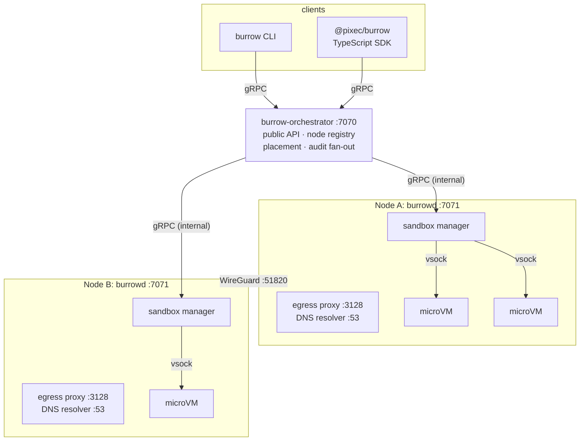

Nodes are authoritative. A node persists its own sandboxes, and the
orchestrator adopts each node's inventory on registration and again on every
heartbeat, so an orchestrator restart rebuilds its view from the fleet rather
than from its own memory, and states a node reached on its own (a suspend, a
reap) replace whatever the orchestrator last set.

The orchestrator does keep a durable copy of placements, which sounds like a
contradiction and is not: it is never consulted in preference to a node. It
covers the one case the fleet cannot answer for itself, every node restarting at
once, after which the sandbox to node mapping would otherwise be gone rather
than merely stale. The moment a node registers, its inventory replaces what was
stored for it.

Everything is gRPC. The same `.proto` files build the daemons and ship with the
SDK, so there is no second REST surface to drift.

## Crates

| Crate | Role |
| --- | --- |
| `burrow-proto` | `api` (client to orchestrator), `node` (orchestrator to burrowd), `agent` (burrowd to guest) protos |
| `burrow-core` | Shared domain types: ids, auth, time |
| `burrow-vmm` | Firecracker process supervision, API client, snapshots, cgroups |
| `burrow-net` | Address allocation, tap devices, nftables policy, mesh |
| `burrow-proxy` | Transparent egress proxy, domain allowlisting, DNS, egress audit |
| `burrow-store` | SQLite persistence |
| `tailcat-rs` | Tailcat server: WireGuard through a DERP relay with NAT traversal, terminated in a userspace TCP/UDP stack |
| `burrow-agent` | Guest binary: runs as PID 1, serves gRPC over vsock |
| `burrow-orchestrator` | Control plane binary |
| `burrow-daemon` | `burrowd` node binary |
| `burrow-cli` | `burrow` CLI |

`burrow-proto` is used by everything. `burrow-vmm`, `burrow-net`,
`burrow-proxy` and `burrow-store` are used only by `burrowd`.

`burrow-agent` is Linux only: vsock, mount syscalls, netlink. It is excluded
from the workspace's `default-members` so a bare `cargo build` still works on
macOS, and `cargo xtask build` compiles it for the guest target.

## The create path

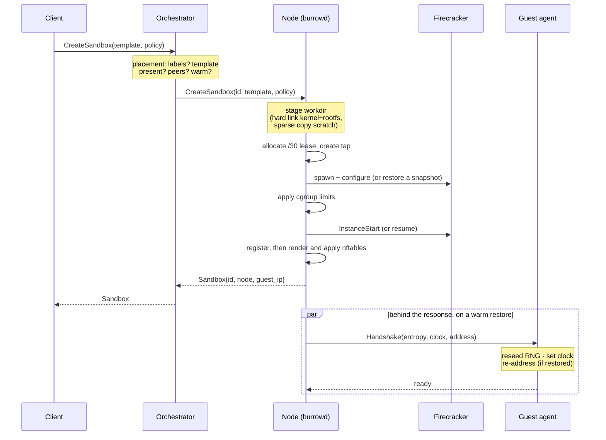

Three orderings in there are load bearing.

**Limits are applied between spawn and start.** The cgroup is written after the
VMM process exists and before `InstanceStart`, so a guest never runs even
briefly uncapped. A host where the cgroup cannot be written logs and continues
uncapped, because the stack has to run where cgroups are unavailable;
`--require-resource-limits` turns that into a refusal to start, and is worth
setting wherever sandboxes share a host with anything that matters.

**The firewall is rendered after the sandbox is registered**, because the
ruleset is a function of the whole set of running sandboxes on the node, not of
the one being created.

**The handshake runs behind the response.** A warm create returns once the VM
is restored and the firewall is up, not once the guest answered. The task that
tells the guest its real address, reseeds it and sets its clock runs behind the
reply, and everything that later reaches the guest awaits that task first
(`RunningSandbox::agent`). So nothing executes in a guest that has not been
fixed up, and no caller pays for a round trip it does not need. Moving the
handshake off this path is most of why a warm create dropped from about 175ms
to about 45ms; see [performance](#performance). A cold boot handshakes inline,
because there is nothing to gain from deferring it behind a boot the caller is
already waiting on.

That leaves one failure case with no create left to fail. The handshake task is
the only thing that knows it gave up, so it is what reclaims the sandbox:
killing the VM, deleting the tap, releasing the lease, removing the working
directory, dropping the record, and logging at `error`, because the caller was
told the create succeeded. A resume handshakes for itself and clears the
failure, so the verdict is re-read before anything is destroyed. The paths that
register a sandbox also reclaim it once it is theirs, so whichever of the two
runs last does the work and a handshake that fails mid-registration does not
fall between them.

## Inside a sandbox

The agent is PID 1. No systemd, no udev, no getty, which is why a cold boot
reaches a working agent in about a second instead of eight. It mounts the
per-sandbox scratch disk (`/dev/vdb`, `scratch.ext4`) as the writable upper
layer of an overlay over the read-only template rootfs (`/dev/vda`), brings up
the pseudo-filesystems, and serves gRPC over vsock port 1024.

Three properties of it are load bearing.

**It owns the only `waitpid` caller.** As PID 1 it must reap orphans, but a
generic `waitpid(-1)` loop would also consume the exit status of processes
started by `Exec`. Whichever caller wins, the other gets `ECHILD` and the exit
code is lost. All waiting goes through one reaper that dispatches statuses to
registered waiters, which is why exec uses `std::process` rather than
`tokio::process`.

**It parks rather than exits.** PID 1 exiting panics the kernel and destroys the
sandbox, so if the server stops the agent blocks forever instead, leaving the VM
inspectable and snapshottable.

**It logs at `warn` by default.** The agent's stdout is the emulated serial
console, written a byte at a time, so every log line costs guest time that shows
up directly in boot and resume latency.

### The vsock handshake

Firecracker does not expose a real `AF_VSOCK` socket to the host. The host
connects to a Unix socket and sends `CONNECT 1024\n`, expecting `OK <port>\n`
back, after which the stream is a plain byte pipe carrying gRPC.

The reply is read one byte at a time, deliberately. The guest speaks first,
because a gRPC server emits its HTTP/2 SETTINGS frame immediately, so a buffered
read swallows the first frame of the real protocol. That presented as an
intermittent 40% "transport error" before it was understood.

### Confining the VMM

Firecracker is the process standing between an untrusted guest and the host, and
by default Burrow runs it as root with the whole filesystem visible. With
`--jailer <path>` it is chrooted into the sandbox's own directory and dropped to
an unprivileged uid (`--jail-uid` and `--jail-gid`, both 65534 by default)
before the guest ever runs. Verified rather than assumed: the process reports
`uid=65534`, and its root contains only that sandbox's files, with
`/usr/local/bin` simply absent.

It costs almost nothing here because the paths were already right. Every
resource handed to the Firecracker API is relative to the working directory,
precisely so that directory can *become* the chroot, so the sandbox directory
and the jail root are the same path and nothing else changes.

Two details are not obvious:

- **Device nodes are recreated on every spawn.** The jailer `mknod`s `/dev/kvm`
  and `/dev/net/tun` inside the chroot and fails with `EEXIST` if they exist. A
  chroot is reused every time a sandbox resumes, so the first resume after a
  suspend fails unless they are cleared first.
- **The page-fault socket changes hands.** burrowd creates it as root, and a
  jailed Firecracker cannot connect to it. Ownership is transferred to the jail
  uid with the mode kept at `0600` rather than widening the mode, because that
  socket is a direct path into a sandbox's guest memory.

Cgroups stay Burrow's own: the jailer gets `--cgroup-version 2` and no
`--cgroup` arguments, which makes it touch no cgroup at all, leaving the limits
Burrow applies by pid intact.

## Networking

Every sandbox gets its own `/30` on its own tap device, named `bt<block>`.
There is no shared bridge: many sandboxes restored from one warm snapshot share
a MAC address, and a shared L2 domain would make them collide.

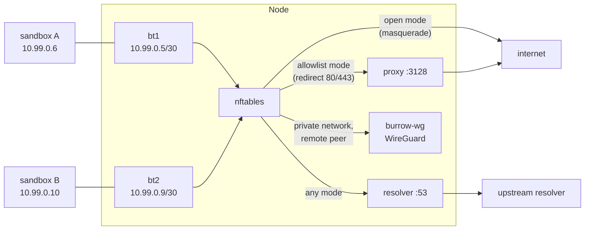

### Firewall structure

What the policy can express (modes, `deny_cidrs`, live updates, credential
brokering) is in [FIREWALL.md](FIREWALL.md). This is how it is enforced.

Base chains use `policy accept` and jump sandbox traffic into burrow-owned
chains that end in `drop`. A `policy drop` on a base hook would govern *all*
traffic on the host, and a firewall for sandboxes must not become a firewall for
the machine.

That puts the weight on selection, because anything not selected falls through
to accept. So selection is by input interface, never by source address: a guest
owns its network stack and can forge any address, but it cannot choose which tap
its packets arrive on.

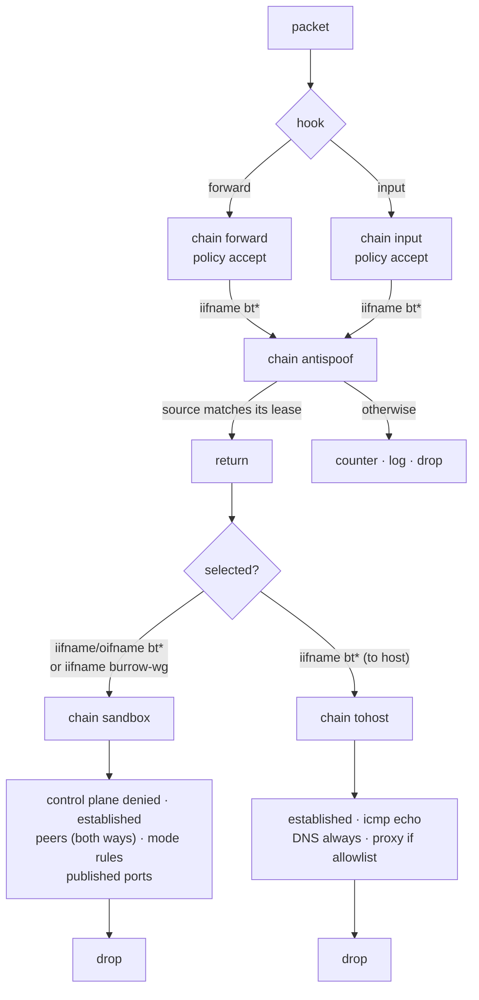

Four details in that ruleset are easy to get wrong.

**Peer rules are emitted in both directions.** A node only renders rules for the
sandboxes it hosts, so an inbound connection from a peer on another node arrives
over the mesh with no conntrack entry. An outbound-only rule drops it, and the
failure looks like a timeout on one side and nothing at all on the other.

**Open mode denies the sandbox pool.** Its blanket egress accept is preceded by
a drop of `10.99.0.0/16`, which is where every sandbox address in the fleet
comes from. Open therefore means egress off the node, not reach into a neighbour
or across the mesh into another node's sandbox. Peer rules come first, so
private networks are untouched, and the guest's gateway is on the input hook
rather than this one, so DNS is untouched too. Egress in open mode is
masqueraded for the same complement, `ip daddr != 10.99.0.0/16`: peer traffic is
not egress, and translating it would present a remote peer with this node's mesh
address, which its rules do not recognise.

**The control plane and every edge are denied to every sandbox**, ahead of the
conntrack accept and every mode rule. An edge router will proxy a request into
any sandbox's published port by id, so reaching one is reaching every sandbox it
serves without ever meeting a rule about sandboxes; the orchestrator's API
creates and deletes sandboxes and routes exec and logs into them, which is a
control surface no sandbox may reach. The orchestrator's address comes from the
node's own `--orchestrator`; the other nodes' edges arrive on the heartbeat,
since an edge is opt-in per node and no node can know from its own flags which
of its peers runs one.

**Mesh traffic skips antispoofing.** WireGuard's `AllowedIPs` already refuses
packets sourced outside the sending node's own slice, which is a cryptographic
check the antispoof chain cannot improve on, and `burrow-wg` is not a tap
anyway.

### Egress modes

| Mode | Behaviour |
| --- | --- |
| `none` (default) | No egress. Name resolution still works, so an attempt is visible in the audit trail. |
| `allowlist` | Web traffic is redirected to the proxy, which reads the TLS SNI or HTTP `Host` header and permits only the named domains. |
| `open` | NAT'd egress to anywhere. |

By default the proxy never terminates TLS: Burrow sees hostnames, never
payloads. That keeps sandbox traffic private and avoids distributing a CA into
guests, at the cost of not being able to see inside a session. Non-SNI TLS is
refused. UDP in allowlist mode is dropped, so traffic falls back to TCP, with
two exceptions: DNS to the node's own resolver, and whatever `allow_cidrs`
names, which renders `udp` accepts alongside `tcp` ones.

Only ports 80 and 443 are redirected into the proxy. The sandbox chain accepts
DNS to the node's own resolver, whatever `allow_cidrs` names, and inbound
traffic to published ports, then drops. So a connection to any other port never
leaves the host: the same request bytes that fetch a page on port 80 get nothing
on 8080. On the two ports that *are* proxied, a payload that is neither a
ClientHello nor an HTTP request is refused as `destination host not
identifiable`, so the proxy is not a way to tunnel an arbitrary protocol to an
allowed address.

`allow_cidrs` is the deliberate exception: a hole at the IP layer for
destinations the proxy cannot reason about, such as a database. `allow_ports`
narrows it to named ports; without it the allowance covers every port and
protocol on those addresses. It was declared in the policy long before anything
enforced it, which made it look like a restriction while being none.

### DNS pinning

The hostname the proxy decides on is one the *client* supplies, while the
address it connects to is one the client chose separately. Nothing ties the two
together, so reading the SNI or `Host` header alone is not an allowlist: a
sandbox dials any address it wants and labels it with a permitted name. That was
not hypothetical. A guest with a spoofed `Host` or SNI header reached an
arbitrary address under an allowed name, and the same trick reached the cloud
metadata endpoint. Both now fail with an audit row naming the reason,
`destination address is not pinned to this name` and `destination is an internal
or metadata address` respectively.

Burrow ties them together with a fact the client cannot forge. It runs the
resolver its sandboxes use, so it records which addresses it returned to which
sandbox for which name, and the proxy connects only to an address that this
sandbox was actually told that name resolves to.

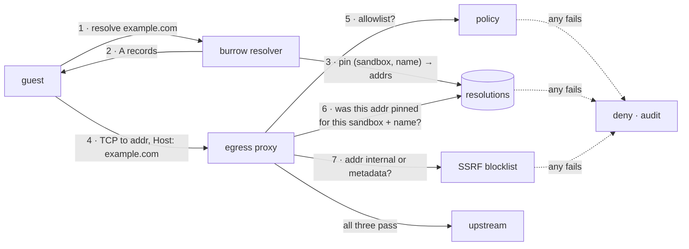

Pins live for the record's TTL, floored at 60s so a lookup and its connection
cannot fall on opposite sides of an expiry, and capped at an hour so a hostile
TTL cannot pin forever. They are keyed by sandbox address, and addresses are
recycled, so pins are pruned against the live sandbox set whenever policy is
re-synced. Otherwise a new sandbox silently inherits its predecessor's
permissions and the check stops being a check.

The blocklist in step 7 is deliberately independent of pinning, because a name
can legitimately resolve into a private range. The proxy runs on the host, so
`169.254.169.254` reached *from* it is the host's own metadata service. That
path leaked node instance credentials until this was added.

**ECH is refused rather than read.** A ClientHello carrying an
`encrypted_client_hello` extension presents a *cover* name, often the provider's
own, while the name actually requested is sealed inside. Trusting the visible
one is worse than seeing nothing: it yields a confident answer that is wrong,
and an allowlisted cover name would front for anywhere that provider hosts. So
the parser walks every extension rather than stopping at the first `server_name`
(ECH can follow it) and the connection is denied with a reason that says so.

### One check per request

Identifying a connection from its opening bytes and splicing the rest is fine
for a protocol that stays pointed at one place. HTTP does not: keep-alive
carries many requests down one connection, each with its own `Host`. Checking
only the first and forwarding the rest blind means a sandbox opens a connection
to an allowed host and then asks that server for anything else it fronts, which
on a CDN is most of the internet.

So HTTP is relayed with request framing understood, not spliced:

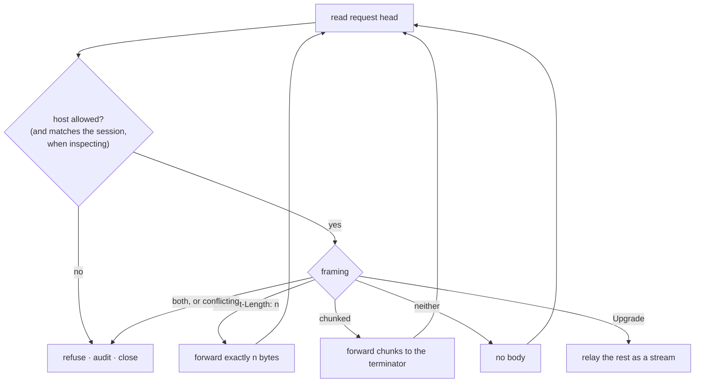

The framing is parsed rather than streamed past because it is what says where
one request ends and the next one, which also needs checking, begins. Getting it
wrong desynchronises the stream, so anything ambiguous ends the connection
instead of being guessed at. A request carrying both `Transfer-Encoding:
chunked` and `Content-Length`, or two `Content-Length` headers that disagree, is
exactly the ambiguity request smuggling exploits, and is refused.

Once a connection upgrades to WebSocket or similar it stops being HTTP, so the
upgrade request is checked and the rest is relayed as an opaque stream to the
host already permitted.

### Inspecting a session

Domain fronting is the case none of the outer checks can see: connect to an
allowed name's address with its name in the SNI, then ask for a different host
inside the encrypted session. Where both names live behind one provider, the
allowlist passes, pinning passes, and the sandbox reaches somewhere it was never
permitted.

Seeing the inner request means terminating the session, so it is opt-in per
sandbox and the default stays hostnames, never payloads. When it is on, the
proxy serves the guest a certificate for the requested name signed by the node's
own authority, opens a real verified session to the origin, and then applies two
checks to the inner request rather than one: the inner host must be allowlisted,
*and* it must equal the name the session was opened for. Otherwise fronting
between two names that are both allowed would still succeed, and per-name
reasoning about where a sandbox talks would mean nothing.

The upstream half is verified normally against the public roots: inspecting must
never become a way to accept a certificate the sandbox itself would have
rejected. The authority is generated once per node and persisted, because the
certificate is installed inside guests and a new one each boot would break every
sandbox that survived a restart. Its key is `0600` and never leaves the node,
and the certificate is given only to sandboxes that opted in. Installing it more
widely would let the proxy impersonate any host to a sandbox that never agreed
to it. A guest that carries its own CA bundle will not see that certificate at
all; see [FIREWALL.md](FIREWALL.md#when-a-guest-does-not-trust-the-inspection-ca).

HTTP/2 is inspected too, per stream, under the same two checks. The proxy offers
the origin exactly the ALPN protocols the sandbox offered and presents the
sandbox only what the origin agreed to, so both halves always speak the same
version and nothing is translated on the policy path. See
[FIREWALL.md](FIREWALL.md#http2-in-an-inspected-session) for the per-stream
rules and the byte-accounting caveats.

### Naming sandboxes on a private network

Private networks already let members reach each other by address, which is
nearly useless: an address is a placement detail that changes whenever a sandbox
is recreated, and nobody writes one into their code. So the node's resolver
serves Burrow's own zone.

```sh
burrow create --template python --network team --alias api
burrow create --template python --network team --alias worker
# from `worker`:  curl http://api.team.internal:8080/
```

| Name | Resolves against |
| --- | --- |
| `<alias>.<network>.internal` | That network, if the caller is in it |
| `<sandbox-id>.<network>.internal` | The same. An id always exists, so a member is addressable without having been named |
| `<alias>.internal` | Every network the *caller* belongs to |

`.internal` is reserved by RFC 8375 for exactly this, and Burrow never forwards
it upstream: a name the directory does not know is `NXDOMAIN`, not a public
lookup.

Membership is checked on the query. A caller outside the network gets
`NXDOMAIN`, the same answer as for a name that does not exist, so names cannot
be used to enumerate the fleet even where the firewall would have dropped the
traffic anyway.

The directory is rebuilt from the same membership snapshot the firewall is
rendered from, local members and remote ones together. Deriving them separately
is how a name ends up resolving to something the firewall then drops. Names work
the same across nodes: a member on another host resolves to its real address and
the traffic rides the mesh.

One interaction is easy to miss. In `allowlist` mode every guest packet to
80/443 is redirected into the egress proxy, which decides by *domain*, so a peer
on port 80 would be denied for not being on the allowlist and private networks
would quietly stop working for any sandbox that also had an egress policy. Peer
addresses are therefore accepted in `prerouting` ahead of the redirect rule,
since nftables takes the first terminating verdict.

### The mesh

Nodes own disjoint slices of the address pool: 256 `/30` blocks each, a `/22`
out of `10.99.0.0/16`, so a guest address identifies the node holding it.
Without this, two nodes would independently hand out identical addresses, which
nothing downstream could disambiguate.

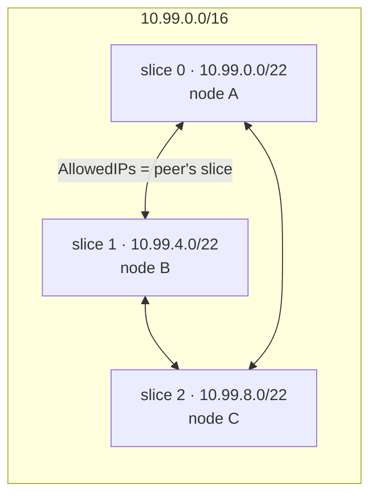

A node claims its slice at registration rather than requesting one: its
sandboxes' addresses derive from it and cannot be moved. The orchestrator
honours the claim unless another node holds it, and logs loudly on conflict. The
slice is applied before recovery, so recovered sandboxes reload into the range
they were created in. `AllowedIPs` doubles as the authorisation rule, since a
node may only send traffic sourced from the slice it owns, which is what lets
mesh traffic skip the antispoof chain.

#### Peer key pinning

Nodes learn each other's WireGuard public keys from the orchestrator, which
makes it a trusted third party for the one thing WireGuard otherwise makes
unforgeable. An orchestrator that substituted a key it held the private half of
would sit inside every cross-node private network, and nothing downstream would
notice: the tunnel would come up and traffic would flow.

So a key is pinned on first sight and immutable after that. The orchestrator can
still introduce new nodes, because it must be able to, but it cannot change the
identity of one that already exists. A conflicting key is refused and the peer is
dropped rather than configured, which is the conservative choice because a node
cannot tell a legitimate reprovision from an attack. Verified by planting one,
after which WireGuard showed zero peers rather than a tunnel to the wrong end.

That leaves the usual trust-on-first-use caveat: the first key is taken on
faith. `--mesh-pins` (default `/etc/burrow/mesh-pins`) names an operator-written
file that overrides anything learned, for deployments unwilling to accept even
that.

## Snapshots and warm creates

A warm snapshot is a template booted once and frozen with its agent ready.
Creates then restore instead of booting: measured on real OCI templates with
45ms median for alpine (36 to 98ms) and 41ms for python (33 to
46ms), against 1.2 to 2.2s for a cold boot. Nodes warm templates on their own,
as each one lands and as creates ask for shapes nothing has warmed yet.

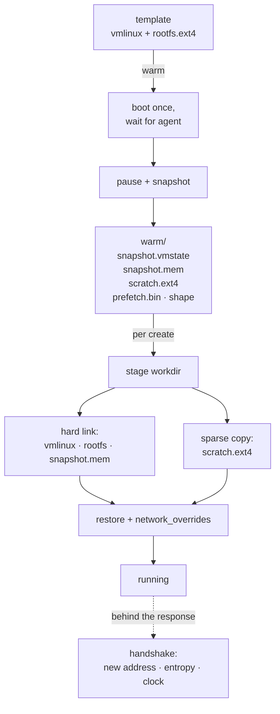

Three things are baked into a snapshot and must not be shared between the
sandboxes restored from it:

| Baked in | Why it matters | How it is handled |
| --- | --- | --- |
| Tap device | Firecracker refuses to restore onto a different one | `network_overrides` names the sandbox's own tap |
| Guest address | Lives in guest memory, so every clone wakes with the same one | The host tells the agent its real lease on handshake, and the agent reapplies it over netlink |
| Scratch disk | The guest's in-memory filesystem state refers to it as it was | Each clone gets its own sparse copy |

The memory file is shared by hard link, which is safe because restoring leaves
it byte-identical. The scratch copy must be sparse: `fs::copy` expands holes,
turning a create into a gigabyte of writes and making warm creates *slower* than
cold.

Clones are independent in the ways that matter: separate filesystems, correct
wall clocks, independent randomness. The guest kernel self-reseeds through
vmgenid or `sysgenid` on restore, and the agent reseeds again via
`RNDADDENTROPY` for kernels that do not.

Two of those are properties the warm path would silently violate rather than
fail on, so `burrowd vm clones` checks both: that two sandboxes restored from
one snapshot produce independent randomness, and that restoring leaves the
memory file byte-identical, which is what makes hard-linking one memory file
across many sandboxes safe in the first place.

### One snapshot per template

A warm snapshot only serves creates asking for the shape it was taken with.
Firecracker restores machine configuration from the snapshot, so a restore
cannot change the guest's cpu or memory: before this was noticed, `--mem-mib
2048` against a 512 MiB snapshot silently produced a 512 MiB guest and no error.
The shape is recorded beside the snapshot, a mismatched request cold-boots
instead, and the node warms that shape in the background so the next create of
it restores.

The cost is that a template holds exactly one snapshot at one shape. Warming a
second shape replaces the first, and each shape is attempted once per daemon
lifetime, so a template used at two shapes is fast at whichever was warmed last
and cold at the other, for as long as the daemon lives. Measured on the dev
harness: 4.7s and 2.5s for the first two creates at an unwarmed shape, the
second still slow because warming runs behind the create that asked for it.

### Guest memory on restore

Restoring with Firecracker's `File` backend leaves guest memory to the kernel:
the snapshot is mapped privately, pages fault in on demand, and every sandbox
restored from one warm template shares that file's page cache.

Burrow can instead serve those faults itself over userfaultfd. Firecracker
creates the descriptor, registers the guest's regions, and hands both to a
handler that fills pages from a read-only mapping of the snapshot.

For a plain snapshot that is a *worse* deal, and the measurement says so: six
sandboxes touching 768 MiB cost 857 to 876 MiB with the handler and 792 to
860 MiB without, because serving a fault in userspace produces a private copy of
every page including ones only read. So `--lazy-memory` is off by default.

The handler earns its place in the two cases the kernel cannot cover: a diff
chain, which has no single file to map, and a prefetch plan.

#### Prefetching

A restored guest takes its faults one at a time, and each is a stalled vCPU and
a round trip into Burrow. There is no need to discover them twice, because the
pages a guest reaches for on the way to a usable agent are the same ones every
time.

So warming a template ends with a profiling restore: the fresh snapshot is
restored once with fault recording on, exercised through a real handshake, and
the offsets it touched (about 1,500, observed) are written to `prefetch.bin`
beside it. Every later create replays that plan in one pass before the guest is
unpaused. Measured: the handshake dropped from about 100ms to 63 to 81ms, for
about 2 MiB of extra host memory across six sandboxes.

Offsets are recorded *into the memory file*, not as addresses: where a region
lands is a property of a particular restore, and replaying raw addresses would
populate the wrong pages.

Two details make it safe. The profiling guest writes to the scratch disk after
the snapshot was taken, so the disk is put back exactly as the snapshot expects;
otherwise a clone would restore in-memory filesystem state that disagreed with
its own disk. And a plan is only ever an optimisation, so it is loaded
best-effort: an unreadable or stale one costs faults, never correctness.

### Suspending

A pause writes a diff rather than the whole of guest memory: the pages touched
since the snapshot the sandbox was restored from, in a sparse file the size of
the guest with holes everywhere else. On a 512 MiB guest that touched 64 MiB,
the pause takes 27 to 150ms and the snapshot occupies 72 MiB.

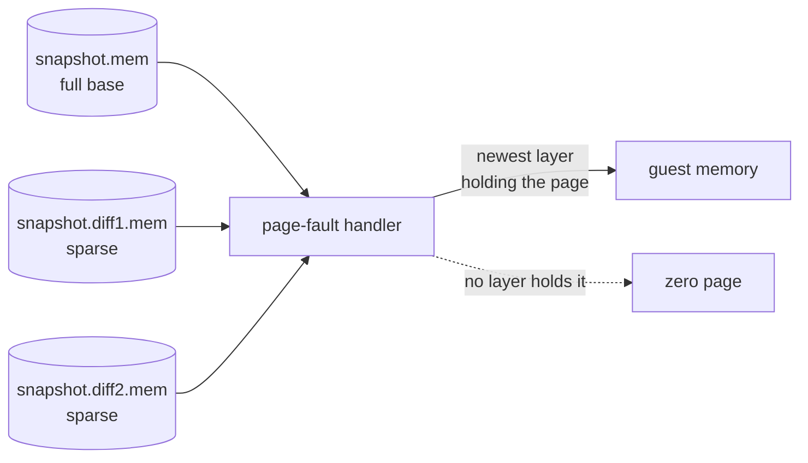

A diff is not resumable on its own, because Firecracker expects it merged with
its base, so the handler does the merge at fault time: for each page it takes
the newest layer that defines it. "Defines" has to be answered through the
filesystem (`SEEK_DATA` and `SEEK_HOLE`), because a hole and a page of genuine
zeroes look identical through a mapping, and a diff that appeared to define
every page would hide the base beneath it.

Chains are bounded, because every layer is another lookup on the path of a
fault. The obvious reset, taking a full snapshot, is the worst option available:
with the handler active it makes Firecracker read the entire guest back through
this process, 6.4s against 44ms for a diff. So the layers are flattened on the
host instead, sequential file work that never touches the guest, at about a
second per flatten.

One consequence to keep in mind: the base a diff layers over must survive being
written alongside. Unlinking the whole snapshot before writing, which is what
protects a warm template from being written through by a hard link, would delete
the base out from under the chain.

#### Writing state without stopping, and forking

The same write with the VM resumed instead of killed is safe to perform on a
live guest, for the reasons above turned around: the files a snapshot replaces
are *unlinked* and the flattener *renames* a new file into place, so the
page-fault handler keeps serving the inodes it already holds. The chain is
extended before the guest is allowed to dirty another page, because what reached
disk is the truth.

That write is a node-internal primitive with no RPC of its own. It captures
memory and not the disk, and the guest goes straight back to writing to
`scratch.ext4`, so the two halves stop agreeing the instant it resumes. It is
therefore only valid to a caller that consumes it at once *and* copies the disk
alongside it, which is what the two callers below do. A "save a restore point"
call could not, which is why there is not one.

A fork copies that state into a new sandbox: the chain whole rather than
flattened, since the restore path reads a chain anyway, and the scratch disk
through the same sparse or reflink copy a warm create uses. The child then takes
the restore path, so it wakes holding the source's processes and the source's
address, which is why the handshake carries the child's real lease exactly as it
does for a warm restore. Forks stay on the source's node: the snapshot, the
disks and the lease are all node-local files, so there is nothing to place.

## Lifecycle and reclamation

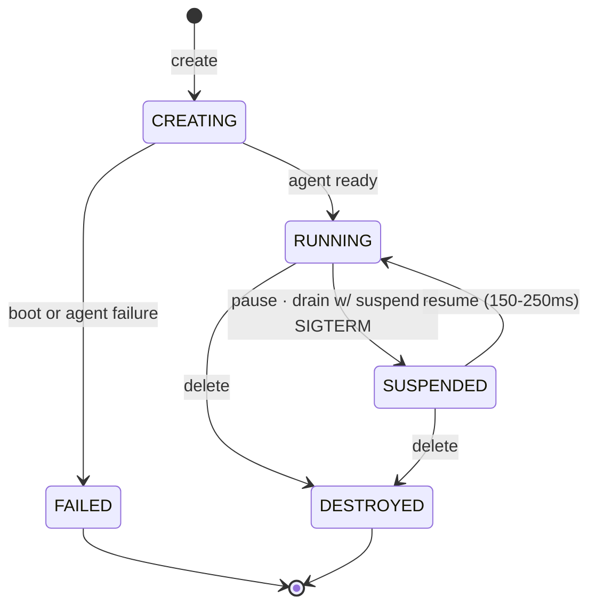

A restart is a pause and a resume. On `SIGTERM` the node snapshots every running
sandbox. On startup it reattaches, reserving address leases before anything else
can allocate, recreating taps, re-rendering the firewall, then garbage
collecting directories with no record. A sandbox that was running when the
daemon *died* has no snapshot and is unrecoverable, so its resources are
released rather than leaked.

`idle_suspend_secs`, `max_lifetime_secs` and `suspended_ttl_secs` are enforced
on the node by a sweep every ten seconds. The two outcomes are deliberately
different: an idle sandbox is **suspended**, which is reversible and keeps its
address, disks and snapshot, while one past its lifetime, or one that has sat
suspended past its retention, is **destroyed**, which is not.

Retention is measured from the moment a sandbox entered `suspended`, and that
timestamp is persisted alongside the record rather than recomputed. A node
restart otherwise either hands every recovered sandbox a fresh TTL or, reading a
missing timestamp as the epoch, deletes all of them at once. A record written
before the field existed is backfilled with *now* for exactly that reason.

"Idle" is measured from the last time anyone reached the guest, counting every
exec, file transfer and watch, and not from the guest's own activity, because a
background job nobody is watching is exactly what the policy exists to reclaim.
The orchestrator's own bookkeeping deliberately does not count.

All three are movable on a running sandbox through `UpdateResources`. One RPC
rather than an `ExtendLifetime` taking a single number, because all three answer
the same question, how long the sandbox stays paid for, and are read by the same
reaper on the same pass. Each arrives as an optional field so that `0` keeps
meaning "unlimited" instead of colliding with "leave it alone". Nothing is
scheduled or cancelled: the reaper reads the policy off the sandbox every tick,
so an extension is in force at the next one.

The machine shape has no path in. Firecracker fixes a VM's configuration when it
starts and takes a restored one's from the snapshot, so there is no point at
which Burrow could honour a reshape. A request carrying one is refused with the
field named, rather than silently dropped, leaving the caller believing their
sandbox grew.

### Sessions

The state diagram shows where a sandbox is, not what it has been through. A
sandbox outlives its VMs: every arrow into `RUNNING` starts one, and every arrow
out stops one. A session is that interval, recorded by the node in its own store
as the VM starts and closed as it stops.

Every path that produces a VM opens one, so the list is the whole history rather
than the subset one code path remembered to write: a cold or warm boot and a
a cold boot and a warm restore both record `boot`, a fork or a create from a snapshot records
`restore`, and a resume records `resume`. Suspend, delete, and a failed resume
after a successful state write close it.

A VMM does not survive its parent, so any session still open when the node
starts belongs to a VM that is already gone. Recovery closes those with
`unknown` and leaves the end time unset, because nothing observed when they
stopped and a backfilled "now" would read as an observation.

Sessions are bounded per sandbox: each node keeps the 64 most recent and evicts
the oldest as a new one lands, which is the one moment the count grows, so a
sandbox suspended and resumed on a loop cannot grow the table for as long as it
lives. They are read from the node that ran the VMs rather than mirrored into
the orchestrator's registry, because the list is bounded per sandbox but
unbounded across a fleet's lifetime, and nothing about placement or capacity is
decided from it.

## Templates

### Starting from an OCI image

A microVM cannot run an OCI image. It boots its own kernel and mounts a root
filesystem from a block device, while an OCI image is an ordered stack of tar
layers meant to be overlay-mounted by a runtime that shares the host's kernel.
There is no "run this image" primitive at the VM layer, so the image is
converted.

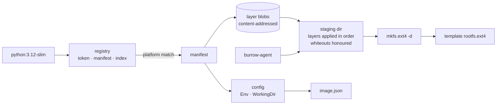

Three parts of that are load bearing:

**Whiteouts.** A layer deletes a path from the layers below it by adding a
`.wh.<name>` entry, and an opaque marker clears a directory wholesale. Skipping
them silently restores files an image removed on purpose, which for a credential
or a setuid binary is a security bug, not a cosmetic one.

**Layers are already content-addressed**, by the same SHA-256 the blob store
uses. So a layer is fetched once across every image that shares it, and is
verified against its digest on arrival by the same code that verifies a template
pulled from a peer.

**The agent is installed as init.** An OCI image has no init, and a VM booted
without one panics. The conversion adds the agent and the mount points a
read-only root cannot create for itself.

Compression is sniffed from the bytes, gzip, zstd, or plain, rather than taken
from the media type, which registries omit often enough and occasionally get
wrong. The bytes cannot be wrong about themselves. Credentials, when configured,
are presented to the registry's *token service* rather than on the request: that
is what determines the scope of the bearer token, and it is why a private image
without credentials 404s rather than 401s. Registries that answer with a plain
`Basic` challenge skip the token exchange entirely.

The secret itself does not have to be in the config file. A `credsStore` or
`credHelpers` entry names a helper, and the node runs
`docker-credential-<name> get` with the registry on its stdin, exactly as docker
does. That runs a binary as root on the node, so the name is held to
`[A-Za-z0-9_-]+`, at most 64 characters, and resolved on `PATH` rather than
taken as a path, no shell is involved, and the helper is given five seconds and
64 KiB of output. A helper that fails, hangs or answers with something
unrecognisable is a warning and nothing else: the pull continues exactly as it
would have without one, because a locked keyring must not turn a public image
into an outage. See [TEMPLATES.md](TEMPLATES.md#credential-helpers).

TLS is assumed unless a host is named in `--insecure-registry`. That is per host
rather than global, because a downgraded pull carries image bytes *and* registry
credentials in the clear, which should be a decision about one registry rather
than all of them.

What is deliberately *not* implemented is the OCI **runtime** spec. Entrypoint,
user, capabilities and signal disposition describe how a container process is
started by a runtime sharing the kernel, while a Burrow sandbox is a VM whose
PID 1 is Burrow's agent. The image's filesystem, environment and working
directory *are* carried over, which is enough that a shell in the sandbox finds
the `PATH` the image intended. Running a real OCI runtime inside the guest, the
way Kata does, would close the rest, and is a different piece of work.

### Building

Steps are cached. A layer is keyed by the base image's rootfs digest plus every
command up to and including that step, so an unchanged prefix is reused and
changing a step invalidates it and everything after it. An identical rebuild took
2.4s against 12.0s cold, and changing the last of three steps took 5.4s.

The cached artifact is the build sandbox's overlay scratch disk. That disk
already holds exactly what the steps changed and nothing else, so caching a
layer is one file copy rather than an export and rebuild per step, which would
cost more than the steps it saves. A rebuild seeds a fresh sandbox's scratch
from the cached layer and skips straight to the first changed step.

The guest is told to `sync` before each layer is captured: its writes reach the
scratch file through virtio, and copying a disk with dirty guest page cache
behind it would cache a filesystem that never existed.

### Distribution between nodes

A template is a kernel and a rootfs, and until they exist on a node that node
cannot run it. Leaving them where they were built makes placement hostage to
build history: one busy node holding the only copy of an image means there is
nowhere to put work.

Artifacts are stored under their SHA-256 digest, which buys three things at
once. A node can say whether it already has something without transferring it,
identical artifacts across templates are stored once, and a received artifact
can be verified rather than trusted.

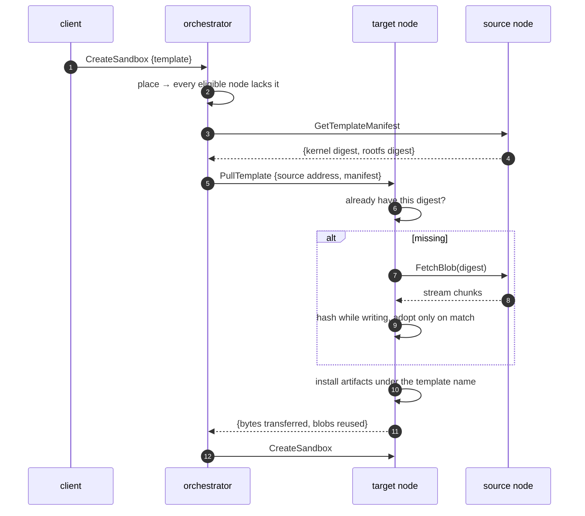

The orchestrator names a source and a target and then stays out of the way: the
bytes go node to node, never through the control plane. Nothing is installed
under the template's name until every artifact is present and verified, so a
failed transfer cannot leave a half-built image that placement would treat as
runnable.

Warm snapshots are deliberately excluded from all of this. They encode host CPU
features and the exact Firecracker version, so the receiving node builds its own
rather than restoring one taken elsewhere.

## Placement

Three constraints are hard: the node has to carry the labels the caller asked
for, the template has to be reachable, and private-network peers have to be
co-located when no mesh can carry traffic between them. Among what remains, a
node holding a warm snapshot wins, and the rest is capacity.

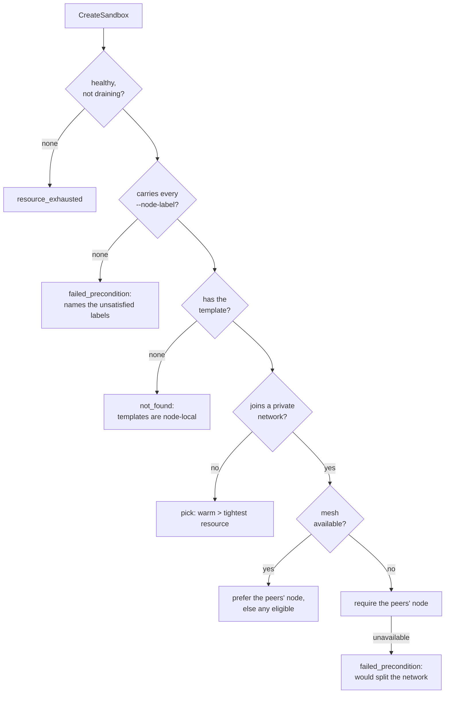

Capacity is scored on whichever resource a node is *tightest* on, not on free
memory: a node can have plenty of RAM and every core committed, and filling it
produces sandboxes that run badly rather than ones that fail to place. Nodes
report committed vCPUs alongside free memory precisely so this is answerable.

Each placement is charged against its target immediately rather than waiting for
the next heartbeat. Placements are far quicker than the 5s heartbeat, so
without that a burst of concurrent creates all read the same stale status and
pile onto whichever node was emptiest a second ago. The reservation is dropped
when a heartbeat arrives, because that status already accounts for it.

One distinction matters more than it looks: a node that has *not reported* its
inventory is given the benefit of the doubt, while a node that has reported an
empty one is taken at its word. Collapsing the two sends sandboxes to nodes that
cannot run them.

### Node labels, which is what Burrow has instead of regions

Burrow is self-hosted, so there are no regions to pick from: there is the
hardware you run it on. Operators say what that hardware is, and callers say
what their workload needs from it.

```sh
# on each machine
burrowd serve --label rack=b7 --label tier=dedicated   # or BURROW_NODE_LABELS=rack=b7,tier=dedicated

# from a caller
burrow create --node-label rack=b7
burrow nodes ls                                        # shows what each node carries
```

A create carrying labels is only ever placed on a node carrying every one of
them, matched as whole pairs. When no healthy node does, the create fails with
`failed_precondition` naming the labels nothing satisfies, and never lands
somewhere else. That is the whole point: a workload asked for on particular
hardware and quietly placed elsewhere is worse than one that was refused.

What it is good for:

- **Rack or host affinity.** Keep a set of sandboxes together, or deliberately
  apart, on hardware you can name.
- **Keeping a workload near its data.** Label the node holding the dataset, the
  license dongle or the fast local disk, and constrain to it.
- **Segregating tenants.** Give a tenant dedicated machines and constrain their
  creates to those labels, so a noisy neighbour is not a possibility rather than
  a probability.

The paths that cannot place check instead of choosing. A fork is built where its
source's state already is, and a create from a snapshot lands where the snapshot
is, so labels there are a precondition: a node that does not carry them is
refused rather than the constraint being dropped.

Labels ride on `NodeInfo`, sent at registration and restated on every heartbeat,
so relabelling a node and restarting it converges within one beat. They are held
to the tag limits, since both are operator-set maps that end up in operator
output: at most 16, keys 1 to 64 bytes, values up to 256, no control characters.

Labels are not recorded on the sandbox. The reason a sandbox landed where it did
is already readable, since the record names its node and `burrow nodes ls` names
that node's labels, and a copy on the sandbox would be a second truth to keep in
sync with an operator who relabels.

### Dead nodes

Nodes heartbeat every 5s. One that has missed three of them, 15s, is
**unhealthy**: reachable in principle, not reachable now. Sandboxes on it are
readable, because reads are answered from the orchestrator's records, but
nothing can be done to them, since every per-sandbox call is routed to the
hosting node and fails with `unavailable` rather than waiting.

Reads say so. The orchestrator stamps `unreachable` on any record whose node is
unhealthy, and `burrow ps -a` shows the state as `lost`. The point is that the
state on record is the last one the node reported, which is a good answer while
the node is up and a stale guess once it is not.

Delete is the exception, because it has to be. Waiting for a node that never
returns would leave a sandbox nobody can remove, holding its name and its
capacity for good. So a delete aimed at an unhealthy node drops the placement on
the orchestrator's word: the record goes, the name and capacity come back, and a
tombstone is written. If that node ever returns still holding the sandbox,
registration destroys it there instead of adopting it back, and the tombstone is
cleared once the node stops listing it. Heartbeats cannot resurrect a tombstoned
sandbox either. Tombstones age out after 30 days, for the node that never comes
back at all. Note the narrowness: this applies only when the registry says the
node is unhealthy. A healthy node that refuses one connection is a transient
failure, and the delete stays an error.

A node silent past `--node-expiry-secs` (default 24 hours, 0 to disable) is
written off entirely. Its entry is dropped and its placements are forgotten,
releasing the names and capacity they held. Deliberately no tombstones here:
nobody asked for those sandboxes to be destroyed, the orchestrator simply
stopped tracking a node it could not reach, so if the node does come back its
own inventory is the truth and reconcile adopts it. One consequence is worth
stating: a name freed that way may belong to another sandbox by then, and the
returning sandbox is adopted without its name rather than taking it back.

## Reaching a sandbox from outside

`burrow expose` maps a guest port onto a host port of the node holding the
sandbox. Host ports come from a hardcoded half-open range, `20000..30000`, so
the usable ports are 20000 to 29999 and there is no flag to move them. A caller
requesting a specific host port is held to the same range.

That leaves the caller having to ask what the address is and store it. An edge
router replaces it with a name. Start a node with `--edge-listen` and
`--edge-domain`, and a request to `<port>-<sandbox-id>.<node-domain>` is
resolved against that node's own sandboxes and spliced into the guest.

The edge runs on the node, and only on the node; there is no orchestrator-side
edge. Sandboxes are node-pinned, so a node-scoped hostname is as stable as a
fleet-wide one would be, and keeping it off the control plane means no bandwidth
bottleneck, no single point of failure for traffic that is not control traffic,
and no detour to another region.

Once a node's edge is serving, every published port on it carries its URL, so
nothing has to reassemble the hostname by hand:

```sh
burrow expose sbx_a 8000
# http://8000-sbx_a.node-b.sandbox.example.com/ -> guest :8000 (node-b:20000)
```

```ts
await sandbox.exposePort(8000);
await sandbox.domain(8000);   // "http://8000-sbx_a.node-b.sandbox.example.com/"
```

The node address stays visible beside it, because that is where the port
actually is. The URL is filled in by the orchestrator, which is the only part
that knows which node holds the sandbox and what that node advertises on its
heartbeat.

An edge is opt-in per node, and a node with no edge configured has no hostname
routing at all: there is no URL, `burrow expose` and `burrow port` print the
node address alone, and `domain(port)` returns a bare `host:port`. A caller is
never handed a hostname that resolves nowhere.

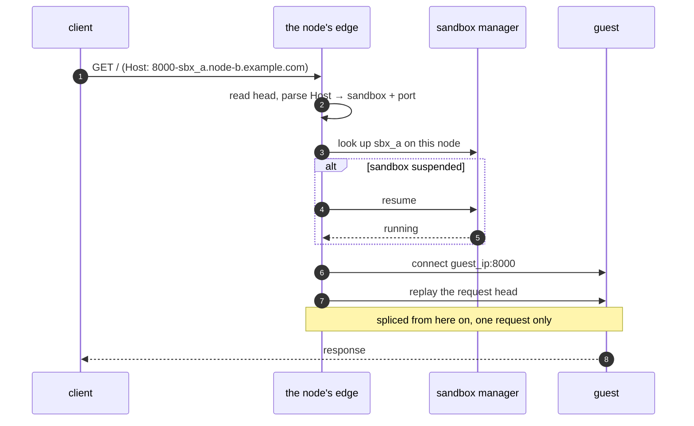

Five decisions carry most of the weight.

**A sandbox this node does not hold is a `404`.** DNS sent the client here
because this is where the sandbox lives, so there is nowhere else to ask. The
wildcard record for a node's domain points at that node and nowhere else.

**The head is parsed, and nothing after it.** The whole head, to the blank line
that ends it: every header line is examined, obs-fold continuations included,
because a forwarding header left behind anywhere in it is a forged client
address a guest cannot tell from a real one. From the body onward the connection
is spliced. Parsing further would break WebSocket upgrades and streaming, and
would make the edge a second place where tenant bytes are interpreted. The head
is replayed to the guest rather than discarded, because those bytes belong to
it.

**A connection carries one request.** It is routed by the hostname in its first
request, so a second on the same connection would reach the sandbox the first
one named, whatever hostname it carried, and a reverse proxy in front pools
connections per upstream rather than per hostname. The forwarded head therefore
carries `Connection: close`, and the client is read only as far as that
request's own body. An upgrade is the exception, and a `101` from the guest is
what makes it one: that is a single request that never ends.

**Traffic resumes a suspended sandbox.** This is what makes `idle_suspend_secs`
safe to enable: an idle sandbox parks, and the cost of having been wrong is a
snapshot restore rather than a failed request. It happens on the node, against
its own sandbox manager, so there is no control-plane call in the path.

**The client address reaches the guest.** The last hop is made by the node, so a
guest would otherwise see the node. The edge rewrites the head it replays,
replacing every forwarding header the client sent with its own, set from the
peer address it accepted.

[EDGE.md](EDGE.md) covers wildcard DNS, a Caddyfile,
`--edge-trusted-proxy`, and how non-HTTP protocols reach a sandbox.

## Observability

Every egress attempt and DNS lookup is recorded per node and queryable through
`burrow audit` or the SDK. Guests resolve through Burrow's own resolver in every
network mode, including `none`, so an attempt to reach somewhere is visible even
when the policy refuses the connection.

Both daemons export OpenTelemetry traces when given `--otlp-endpoint`, and the
trace context crosses the orchestrator to node hop, so a create is one trace
spanning both processes rather than two unrelated ones. Without the flag,
tracing stays local and nothing is exported.

### Usage metering

Every sandbox record carries `cpu_usage_usec`, `rx_bytes` and `tx_bytes`,
visible through `burrow inspect`, `burrow stats` and `sandbox.usage` in the SDK.

**CPU** comes from the cgroup that already caps the sandbox. The same `cpu`
controller that enforces `cpu.max` accounts for it in `cpu.stat`, so the figure
covers the whole VMM, the guest's vCPU threads and Firecracker's own work on
their behalf, and needs nothing from inside the guest. It excludes host work
done outside that cgroup: the daemon's own bookkeeping, and the egress proxy's
share of a request the sandbox made.

**Network** comes from named nftables counters in a `burrow_meter` table of its
own. Each sandbox gets a pair, hooked at prerouting and postrouting rather than
at `forward`, because a sandbox in allowlist mode egresses to a proxy on the
host and that never crosses the forward hook. Matching is by interface, like
every other policy decision here. So bytes are counted where the guest actually
moved them, once, and proxied egress is counted as the guest sent it rather than
again as the proxy forwarded it. Counting sits ahead of the policy chains, so
what a sandbox tried to send is counted whether or not the policy went on to
drop it.

Counter names are derived from the address Burrow assigned, never from a name a
caller chose. `nft -f -` reads a script one command per line, so a string
reaching it verbatim is rule injection; an `Ipv4Addr` has already been parsed
and can only render as four dotted numbers. The counters are rendered into the
same transactional script as the rest of the ruleset, so they appear and
disappear with a sandbox's rules.

Both counters restart from zero underneath a sandbox that has not: a resume
builds a fresh cgroup, and any re-render flushes the counter table. So the node
carries totals on the record and folds each reading into them, treating a
reading below the last one as a replaced counter rather than a rewound one.
Readings are taken on the reaper's tick, before any ruleset is applied, and once
more before a VM is killed, since the cgroup goes with it. The totals are
persisted with the sandbox, so they survive a suspend, a resume and a restart of
the daemon, and they reach the orchestrator on the heartbeat, which is what
makes a read answered from its registry current.

Be aware of what this is not. The figures are as fresh as the last sample, which
is at most a reaper tick old. A sandbox that never ran reports zeroes. A forked
child starts from zero, because a restore copies state, not the bill for
producing it. And nothing is metered on the orchestrator, so a fleet total is a
sum of node reports rather than an independently kept number.

## On disk

```
/var/lib/burrow/
├── node.db                    sandboxes · sessions · published ports · shares · egress audit
├── node-index                 this node's address-pool slice
├── wireguard.key              mesh identity (0600)
├── tailcat-region.json        the DERP region shares listen through
├── images/<template>/
│   ├── vmlinux
│   ├── rootfs.ext4            read-only base, shared by hard link
│   └── warm/                  snapshot.vmstate · snapshot.mem · scratch.ext4
│                              prefetch.bin · shape
├── sandboxes/<id>/
│   ├── vmlinux, rootfs.ext4   hard links to the template
│   ├── scratch.ext4           this sandbox's writable layer
│   ├── snapshot.*             present once paused
│   ├── fc.sock, vsock.sock    Firecracker API and guest transport
│   └── console.log            guest serial output
├── snapshots/<snapshot-id>/
│   ├── manifest.json          template · shape · size · expiry, written last
│   ├── vmlinux, rootfs.ext4   hard links, so the snapshot outlives the template
│   ├── scratch.ext4           the source's disk at the moment it was taken
│   └── snapshot.*             vmstate and one flattened memory image
└── logs/egress.jsonl          audit, for log shippers
```

A snapshot is assembled in a `.staging-<id>` directory beside these and renamed
into place, with the manifest written last, so a crash never leaves a
half-copied snapshot that reads as complete. Its memory is flattened to a single
image on the way in, so restoring costs the same however many times the source
had been suspended.

Every path handed to Firecracker is relative to the sandbox's working directory.
Restore requires resource paths to match what they were at snapshot time, so
keeping them identical across sandboxes makes restore work by construction
rather than by bookkeeping, and it is also what lets the working directory
become the jail root.

## Performance

Measured on the node from its own create timings, so these are the system's
latencies rather than client or CLI startup. The harness is nested
virtualization on an M5, so a real Linux host is faster.

A create from a warm snapshot, on OCI templates imported with `burrow pull`:

| Template | median | range | n |
| --- | --- | --- | --- |
| `alpine` | 30ms | 16 to 109ms | 14 |
| `python:3.12-slim` | 33ms | 20 to 71ms | 13 |

A cold boot of the same alpine template is 1.9 to 2.4s, nearly all of it kernel
and userland init. The first create of a template at a shape nothing has warmed
pays that plus building the snapshot; see [one snapshot per
template](#one-snapshot-per-template).

## Development

The local harness runs an orchestrator and two nodes inside containers on a
nested-virtualization VM, so cross-node behaviour is exercised rather than
assumed. The containers are privileged, which is an artifact of running a node
inside a container rather than the deployment model. A real node is `burrowd`
running as root on the host.

See the [README](../README.md#quickstart) for first-time setup. The everyday
loop is build and up:

```sh
cargo xtask build      # cross-compiles to aarch64-unknown-linux-musl
docker --context colima-burrow compose -f deploy/dev/compose.yaml up -d --build
```

`cargo xtask build` output is mounted at `/burrow/bin` in the containers, so
rebuilt binaries are picked up by the next `docker exec` without recreating
anything. Long-running services still need a restart to pick up a new build.

Production nodes are x86_64. `cargo xtask deploy --host <ssh-host>` builds for
`x86_64-unknown-linux-musl` and rsyncs. Snapshots are per node, so mixed
architectures across the fleet are fine.

To run the same two components on Kubernetes, the orchestrator as a StatefulSet
and one `burrowd` per KVM-capable machine as a DaemonSet, see
[deploy/k8s](../deploy/k8s/README.md). The cluster schedules the daemons only: a
sandbox is a microVM `burrowd` places itself, and `kubectl` cannot see one.

### Keeping the SDK protos in sync

Both SDKs ship their own copies of the `.proto` files, because they are
published separately and cannot reach into this workspace; the TypeScript one
loads them at runtime. Copies drift, and these did, so `cargo xtask protos`
writes them and a test in `burrow-proto` fails if a proto changes without it.

The Python SDK also commits the code generated from its copies, so installing it
needs neither protoc nor grpcio-tools. That is a second way to drift: the copies
can be current while the generated modules are stale, and stale modules import
and run while disagreeing with the server about the wire.

[`.github/workflows/ci.yml`](../.github/workflows/ci.yml) checks both on every
push and pull request, alongside `cargo fmt --check`, `cargo clippy --workspace
--all-targets -D warnings` and `cargo test --workspace`:

```sh
cargo xtask protos --check                       # the .proto copies in both SDKs
python sdk/python/scripts/genproto.py --check    # the generated Python modules
```

It also runs each SDK's own tests, which the Rust workspace cannot reach, on the
lowest Node and Python each declares support for.

### The guest kernel and templates

The node image bundles `firecracker` and `jailer` but no guest kernel, because
the kernel is an operator's choice and an OCI image does not carry one. Fetch
the FC-CI kernel into the node's data directory, which is where
`--guest-kernel` looks by default:

```sh
docker --context colima-burrow exec burrow-node-1 sh -c '
  curl -fsSL -o /var/lib/burrow/vmlinux \
    https://s3.amazonaws.com/spec.ccfc.min/firecracker-ci/v1.13/aarch64/vmlinux-6.1.141'
```

Templates come from OCI images. There is no built-in template and a create must
name one:

```sh
burrow pull alpine:latest
```

### Exercising the VMM layer and the agent

```sh
# Boot N microVMs and report latency.
docker --context colima-burrow exec burrow-node-1 /burrow/bin/burrowd vm boot --repeat 5

# Boot, set guest state, snapshot, kill, restore, verify the state survived.
docker --context colima-burrow exec burrow-node-1 /burrow/bin/burrowd vm snapshot

# Time to usable userspace with no distro init in the way (the floor).
docker --context colima-burrow exec burrow-node-1 /burrow/bin/burrowd vm floor \
  --extra-boot-args "quiet loglevel=0"

# Boot and handshake with the agent over vsock.
docker --context colima-burrow exec burrow-node-1 /burrow/bin/burrowd vm agent \
  --rootfs rootfs-agent.ext4 --extra-boot-args "quiet loglevel=0"

# Run a command inside a sandbox.
docker --context colima-burrow exec burrow-node-1 /burrow/bin/burrowd vm exec \
  --rootfs rootfs-agent.ext4 --extra-boot-args "quiet loglevel=0" \
  -- /bin/sh -c 'echo hi; uname -a'

# Restore two sandboxes from one snapshot; check they are independent and that
# the shared memory file survives unmodified.
docker --context colima-burrow exec burrow-node-1 /burrow/bin/burrowd vm clones \
  --rootfs rootfs-agent.ext4 --extra-boot-args "quiet loglevel=0"
```
