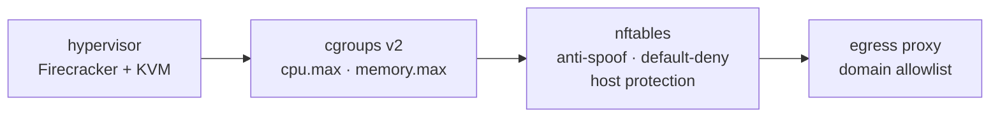

# Concepts

A Burrow sandbox is a Linux virtual machine for running code you do not trust:
agent output, user submissions, build steps. Each one is a Firecracker microVM
with its own kernel, filesystem and network, cheap enough to create per task and
disposable enough to throw away afterwards. Give every agent its own machine,
or fork one prepared workspace into fifty.

## How a sandbox runs

You create a sandbox from a template: a prepared rootfs image, usually imported
from an OCI image ([TEMPLATES.md](TEMPLATES.md)). The node boots that as a microVM,
or restores it from a warm snapshot in 40ms to 50ms, against 1.2s to 2.2s for
a cold boot. Inside, `burrow-agent` runs as init (`init=/usr/bin/burrow-agent`
on the kernel command line) and executes your commands over vsock.

Defaults are 1 vCPU and 512 MiB of guest memory, changed with `--vcpus` and
`--mem-mib` at creation. A VM's shape is fixed once it starts, and a restored
VM takes its shape from the snapshot, so there is no way to reshape a running
sandbox.

### Ids and names

Every sandbox gets an id from the orchestrator: `sbx_` followed by a uuid. You
can also give it a name at creation, 1 to 63 characters of lowercase letters,
digits and `-`, not starting or ending with a dash. Names are unique across the
fleet and fixed for the sandbox's life. Nothing generates one, so a sandbox you
did not name simply has none.

Anywhere the API or CLI takes a sandbox, either works:

```sh
burrow create --template python --name api
burrow exec api -- python3 -c 'print(1 + 1)'
burrow stop api
```

The id is tried first and the name second. They cannot be confused for each
other: an id carries a `sbx_` prefix, and a name may not contain an underscore.
Creating a sandbox with a name already in use fails with `AlreadyExists`, which
is what makes `getOrCreate` in the SDKs work: look up the name, and create it
only if the lookup found nothing.

### The lifecycle

A sandbox keeps its identity across VM boots.

| Action | What happens |
| --- | --- |
| Create | Boots or restores a VM, applies network policy, returns when the agent is ready |
| Exec | Runs commands inside the guest, streaming output |
| Pause | Snapshots memory and disks, stops the VM |
| Resume | Boots a new VM from the snapshot, processes continue |
| Snapshot | Keeps the current state as an object new sandboxes can start from |
| Fork | Copies the current state into a new, independent sandbox |
| Delete | Destroys the VM, its snapshots, lease, and firewall rules |

[PERSISTENCE.md](PERSISTENCE.md) covers this in detail. Network policy is set at
creation and can be replaced live ([FIREWALL.md](FIREWALL.md)). Sandboxes carry
key-value tags for filtering ([TAGS.md](TAGS.md)).

## Security model

Burrow assumes the code inside a sandbox is hostile. Everything below states
where a boundary sits, what it holds, and what it does not.

### Trust boundaries

| Boundary | What is on the untrusted side | What enforces it |
| --- | --- | --- |
| Guest to host | Everything the sandbox runs | Firecracker plus KVM, optionally under the jailer |
| Guest to network | Every packet a guest emits | Per-sandbox tap, nftables antispoof and policy chains, the egress proxy, the DNS resolver |
| Guest to guest | Sandboxes on the same node or across the mesh | Per-sandbox `/30` on its own tap, no shared L2, private-network membership checks; the sandbox address pool is denied to every egress mode, published ports admit only off-fleet traffic, and the orchestrator's API and every node's edge router, which proxies into published ports, are denied to sandboxes |
| Client to control plane | Anyone who can reach the API port | Bearer-token authentication |
| Node to control plane | Anyone who can reach the node-registration surface | A separate node token |
| Image content to node | Registry bytes and build output | Digest verification, escape-proof unpack, size budgets |
| Secrets to guest | Credentials the workload must use but must not hold | Host-side header injection, redaction in API responses |

### The guest is untrusted

Guest code runs in a Firecracker microVM with its own kernel. There is no shared
kernel between a sandbox and the host, and none between two sandboxes.

Confinement goes one step further with `burrowd serve --jailer <path>`, which
chroots each Firecracker process into that sandbox's own directory and drops it
to `--jail-uid` (default `65534`). It then holds no root and sees no filesystem
outside the one sandbox. The flag is off by default because it needs a uid to
drop to and a writable chroot base, and it is what should be on wherever
sandboxes share a host with anything that matters.

CPU and memory are capped with cgroup v2 (`cpu.max` and `memory.max`) under
`--cgroup-root`, default `/sys/fs/cgroup`. Limits are applied by pid between
spawn and start, so a guest never runs even briefly uncapped, and
`--require-resource-limits` makes a sandbox whose limits cannot be applied fail
to start rather than run without them. `vcpu_count` decides how many vCPU
threads exist, not how much host CPU they consume, so `cpu.max` is what stops
one sandbox starving its neighbours.

The guest agent is reachable only from the host. `burrow-agent` binds
`VMADDR_CID_ANY`, because a guest cannot bind its own cid, and then refuses any
accepted connection whose peer cid is not `VMADDR_CID_HOST`. Its API is
unauthenticated by design: a process inside the guest reaching it over vsock
loopback would be reaching the control surface of its own sandbox.

### The network is default-deny

A sandbox created without `--net` has no egress at all. The three modes are
`none`, `allowlist` and `open`.

- Selection is by input interface, never by source address. A guest owns its
  network stack and can forge any address, but it cannot choose which tap its
  packets arrive on.
- Each tap is antispoofed. A packet whose source is not that sandbox's assigned
  lease is counted, logged with the `burrow-spoof` prefix, and dropped before
  any policy rule sees it.
- Sandbox chains fail closed. Every burrow-owned chain ends in `drop`, and rules
  are rendered from parsed, validated values only: a record with an invalid
  policy renders with no allowances rather than poisoning the ruleset.
- The host is off limits. In every mode, guests reach only Burrow's own resolver
  and egress proxy on the host. The node's gRPC API and the sandbox proxy port
  are unreachable from a guest, because a sandbox that reached the node API
  could create, delete and exec into its neighbours.
- Egress is policy-gated by name. In `allowlist` mode, ports 80 and 443 are
  redirected into the proxy, which reads the TLS SNI or the HTTP `Host` header
  and permits only allowed domains. Every other port is dropped by nftables and
  never reaches the proxy at all.
- Names are pinned to addresses. The proxy connects only to an address that
  *this* sandbox was actually told that name resolves to, so a spoofed SNI or
  `Host` header cannot point at an arbitrary destination.
- Private addresses are refused. Independently of pinning, the proxy will not
  connect on a sandbox's behalf to loopback, link-local, private,
  carrier-grade-NAT, broadcast, multicast or unspecified addresses. The proxy
  runs on the host, so `169.254.169.254` there is the host's own metadata
  service. IPv6 destinations are refused outright.
- DNS is filtered, and a guest cannot route around it. The only accept for
  port 53 is to the sandbox's own gateway, where burrow's resolver listens, so
  rewriting `/etc/resolv.conf` to a public resolver produces packets that match
  no rule and are dropped. There is no rule in any mode that lets port 53 leave
  the node.
  Queries that do reach the resolver are forwarded upstream only when the
  policy allows the name, which closes DNS-tunnel exfiltration. A refused query
  is answered `REFUSED` rather than a forged `NXDOMAIN`, and every refusal is
  audited.
- A sandbox in `none` mode has no DNS at all, rather than filtered DNS. A name
  is attacker-chosen bytes leaving the sandbox, so a resolver is an exfil
  channel like any other and `none` means none.
- Inspection is opt-in. With `--inspect-tls` the proxy terminates TLS for that
  sandbox and checks the host inside the session, which is the only way to catch
  domain fronting. Without it, Burrow sees hostnames and never payloads.

What the network boundary does not claim: `allow_cidrs` is a deliberate hole at
the IP layer that bypasses the proxy entirely, and without `allow_ports` it
covers every port and protocol on those addresses. Traffic permitted that way is
not inspected.

### API callers are authenticated

Clients present a bearer token (`--api-key` or `--api-key-file`, sent as
`authorization: Bearer <token>`). Several tokens in a file let a key rotate
without downtime.

Nodes present a separate node token (`--node-token` or `--node-token-file`) to
register and heartbeat. Separate on purpose: an API client must not be able to
register a node of its own over a real one and receive other tenants' exec and
log traffic.

Authentication is off unless a token is configured, and both daemons say so
loudly at startup when it is not. Do not run a node without one.

A node's edge is denied to every sandbox in the fleet, its own included, and
answers only for the sandboxes its node holds. Forwarded sandbox traffic carries
the cluster token in its prelude, so the node's sandbox-proxy port is not an open
relay into anyone's sandbox.

### Image content is hostile

- Digests are verified. Layers, manifests and the image config are checked
  against their digests, so `image@sha256:...` pinning is real. Layer bodies are
  also checked against the manifest's declared sizes, capped at 8 GiB compressed
  per layer.
- Unpack cannot escape. Layer entries cannot write or delete outside the staging
  directory: absolute paths, `..` and symlinked-parent tricks fail the import,
  whiteout handling included.
- Extraction is budgeted. A layer may not expand past 32 GiB or 1,000,000
  entries, so a decompression bomb fails instead of filling the node's disk.
  Template build exports are capped at 8 GiB.
- Credentials stay on the registry's host. They are sent only to a token realm
  on the registry's own host, over HTTPS unless that host is named in
  `--insecure-registry`. The one exception is a short hardcoded list of known
  token services, which is how Docker Hub's `auth.docker.io` works.
- A received template artifact is verified against its digest before it is
  adopted, so a peer serving the wrong bytes poisons nothing.

### Secrets stay out of the guest

Credentials brokering injects a header on the host side, so untrusted code can
call an authenticated service without holding the credential. Every response
that carries a policy back out of a node replaces each injected value with
`<redacted>`, keeping the domain and header name visible. The orchestrator
mirrors what the node returns, so it never holds the real value either. See
[FIREWALL.md](FIREWALL.md#credentials-brokering).

### Exec and file policy

The `Policy` message's `exec` and `fs` sections limit what a caller may do to a
sandbox. The node enforces them in its own handlers, before a path or a byte
reaches the guest agent, because the agent sits inside the boundary these
sections draw and so cannot be the thing that holds them.

- `allow_exec: false` refuses `Exec`, and with it `burrow connect` and
  `burrow run`, with `PERMISSION_DENIED`.
- `allow_upload: false` and `allow_download: false` refuse `UploadFile` and
  `DownloadFile`.
- `path_scopes` confines uploads, downloads, listings and watches to paths under
  one of the given prefixes. Matching is on whole path components, so `/data`
  admits `/data/in.csv` and refuses `/database/dump.sql`, and a path carrying
  `..` or a relative path is refused rather than resolved.
- `max_upload_bytes` caps a single upload. The stream is cut off at the chunk
  that crosses the cap with `RESOURCE_EXHAUSTED`, and the node makes a
  best-effort delete of what had already been written.

An **absent** section allows everything it covers, which is what every sandbox
created without one carries. A **present** section is enforced exactly as
written, so a caller that names one field settles all of them.

Template builds are unaffected: a build's sandbox is created by the node itself
and drives its agent directly, so no caller's exec or fs policy applies to it.

#### Changing them on a live sandbox

`UpdateAccessPolicy` replaces either section on a sandbox that already exists.
Nothing reaches the guest: both sections are enforced in the node's own
handlers, and the node reads them off the record on every call, so a policy
changed here governs the next call.

```sh
burrow config access sbx_2f0c --no-exec
burrow config access sbx_2f0c --allow-exec
```

```ts
await sandbox.update({ exec: { allowExec: false } });
```

What a section's presence means here is deliberately not what it means on
create:

- A section you **send** replaces that section wholesale. A field you leave out
  of it is an allowance withdrawn, exactly as on create.
- A section you **omit** is left as it is. It does not become "allow
  everything".

That difference is the point. On create, an omitted section is what an
unrestricted sandbox looks like. On an update, reading it the same way would
mean a caller tightening `fs` had silently re-opened `exec`, the opposite of
what they asked for. So tightening one section never touches the other, and
there is no way to loosen a policy by not mentioning it.

Within a section there is no partial update: sending `fs` at all replaces
`allow_upload`, `allow_download`, `path_scopes` and `max_upload_bytes` together,
so restate the parts you want kept. Scopes are validated exactly as a create
validates them.

### Running as separate users

Everything in a sandbox runs as root by default. When one sandbox hosts several
agents, give each of them a Linux user instead:

```sh
burrow user create sbx_2f0c alice
burrow exec sbx_2f0c --user alice -- whoami
```

Each user gets a home directory created `0700`, so one agent cannot read
another's files, its `~/.ssh`, or whatever it left in its working directory. A
command run with `--user` starts in that home and gets `HOME`, `USER`, `LOGNAME`
and `SHELL` to match. Groups are how two users share something deliberately: a
group comes with a directory that is group-owned and setgid `2770`, so a file
one member creates in it stays readable by the rest of the group and by nobody
else.

This is a real boundary, and it is the ordinary Unix one. It stops an agent
reading another agent's files by accident or on purpose, and it makes the blast
radius of a compromised dependency the one user that ran it.

It is not a sandbox. The users share a kernel, a page cache, a network namespace
and a VM. A kernel bug reachable from one user is reachable from all of them,
they can see each other's processes in `/proc`, and root in the guest still
reaches everything: the guest agent runs as root, so file uploads, downloads and
listings are not confined by these permissions either. Anyone who can call the
API can run a command as root by simply not passing `--user`.

So use users to separate agents that are meant to cooperate, and separate
sandboxes for workloads that must not reach each other at all. The isolation
Burrow is built on is the microVM boundary described above; this sits inside it.

### Where each layer sits



Each layer is the *only* one that can enforce its concern. Firecracker bounds
guest memory but not CPU. nftables is the only place that can stop a sandbox
reaching the host. The proxy is the only place that sees a hostname, because
policy is written in domains and the firewall only sees addresses.
[ARCHITECTURE.md](ARCHITECTURE.md) is where each of them is built.
